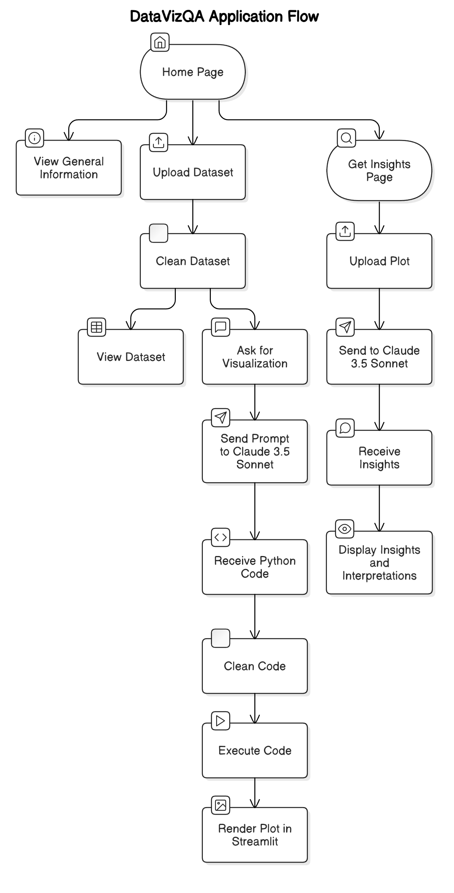

# DataVizQA

## Overview
DataVizQA is a user-friendly application that allows users to interact with tabular datasets by asking questions and receiving meaningful visualizations and interpretations in return. It is designed to handle a variety of datasets, ensuring robustness and relevance in its outputs.

The application is built using **Streamlit** for the interface and integrates **Claude 3.5 Sonnet** to generate Python code for visualizations. Users can upload data, clean it, and generate insightful plots with AI assistance. Additionally, users can upload plots and receive automatic insights and interpretations.

## Features
- **Home Page**: 
  - General information about the application.
  - Upload, clean, and view datasets.
- **Data Visualization Page**:
  - Upload and clean datasets.
  - Ask for specific visualizations in natural language.
  - Prompts are sent to Claude 3.5 Sonnet, which returns Python code.
  - The generated code is cleaned, executed, and the plot is rendered in the Streamlit environment.
- **Get Insights Page**:
  - Upload a plot and receive automatic insights and interpretations using Claude 3.5 Sonnet.

## Project Structure
```
📦 data-viz
├── .github/                     # GitHub-specific configurations
│   ├── workflows/               # Github Workflows
├── docs/                        # Documentation files
├── src/                         # Source code
│   ├── data_viz/                # Main application directory
│   │   ├── __init__.py          # Package initialization
│   │   ├── chat.py              # Handles interactions with Claude 3.5 Sonnet
│   │   ├── home.py              # Home page implementation
│   │   ├── insights.py          # Insights page implementation
│   │   ├── llm_integration.py   # LLM request handling
│   │   ├── main.py              # Main application entry point and routing
│   │   ├── utils.py             # Utility functions
├── tests/                       # Unit tests
├── .env                         # Environment variables
├── .gitignore                   # Git ignore file
├── .pre-commit-config.yaml      # Pre-commit hooks configuration
├── LICENSE                      # License information
├── poetry.lock                  # Poetry dependency lock file
├── pyproject.toml               # Poetry project configuration
├── README.md                    # Project documentation
├── assets/                      # Folder containing diagrams
│   ├── diagram.png              # Project architecture diagram
```

## Architecture Diagram


## Installation
1. Clone the repository:
   ```bash
   git clone https://github.com/your-username/data-viz-qa.git
   cd data-viz-qa
   ```
2. Install dependencies using Poetry:
   ```bash
   poetry install
   ```
3. Activate the virtual environment:
   ```bash
   poetry shell
   ```
4. Run the Streamlit application:
   ```bash
   streamlit run src/data_viz/main.py
   ```

## Usage
1. **Upload your dataset** on the home page.
2. **Clean and view the data** before analysis.
3. **Ask for visualizations** using natural language.
4. **Review the generated plot** and the corresponding Python code.
5. **Upload a plot to get insights** and AI-generated interpretations.

## Contributing
Contributions are welcome! Please follow these steps:
- Fork the repository.
- Create a new branch.
- Make changes and test them.
- Submit a pull request.

## License
This project is licensed under the MIT License. See the [LICENSE](LICENSE) file for details.

## Contact
For any inquiries or issues, please open an issue on GitHub or contact the maintainers.
